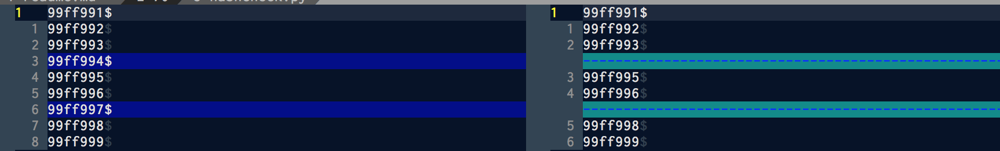

# 副手ツール

## ./normalize.sh
学生毎のディレクトリ構造を統一
プロジェクトとして開けるように package 構造の割り振り

## ./hashcheck.py
コピペチェッカー, 画像ファイルのコピペチェック


# 採点流れ
[締切時間を回ってから行なう]
評価は問題毎に行い, 評価用スプレッドシートに記録する

1. (nas に接続して) rsync で課題を同期する
2. 課題自体の未提出者を確認し, 0 を付ける
3. ./normalize.sh 実行
4. ./hashcheck.py の設定と実行
5. 問題毎の未提出者を確認し, 0 を付ける
6. 1, 5 の評価をつける
7. 残りに 3 をつける


## (nas に接続して) rsync で課題を同期する

```
rsync -t -r -z --progress --stats $REMOTE_PATH ./ex1
```


## 課題自体の未提出者を確認し, 0 を付ける
未提出者の確認は, nums (学籍番号リスト) と提出ディレクトリの存在する学籍番号(\\ls) の diff で行う




## ./normalize.sh 実行
課題ディレクトリに ./normalize.sh をコピーして,実行


```sh
$ cd ./ex01/
$ cp ../normalize.sh ./
$ ./normalize.sh
```


## ./hashcheck.py の設定と実行
課題ディレクトリに ./hashcheck.py をコピーして編集し実行

```sh
$ cp ../hashcheck.sh ./
$ vim ./hashcheck.py
```

今回の課題で必要なファイルの正式名をリストとして記入

```diff:hashcheck.py
- checkfiles = ["Main.java"]
+ checkfiles = ["Car.png", "/Ellipse.java", "/Circle.java"]
```

```sh
$ cp ../hashcheck.sh ./
$ vim ./hashcheck.py
$ python ./hashcheck.py
```


## 問題毎の未提出者を確認し, 0 を付ける

```sh:sample_output
# /Car.png
 ## exists check:
  s99fi991: no file </Car.png>, or []
  s99fi996: no file </Car.png>, or ['Cer.png']
  s99fi998: no file </Car.png>, or []
## copies:
  [['s99fi992', 's99fi993']]
  count: 1
```

上のサンプル出力では  
s99fi991, s99fi998 は未提出者で, s99fi996 はファイル名ミスであることが分かる  
s99fi992 と s99fi993 は複製を行ったと分かる  


## 1, 5 の評価をつける
問題毎にチェックしていき, 良い場合は5, 悪い場合は 1 の評価をスプレッドシートに記入する


## 残りに 3 をつける
スプレッドシートの置換を使い, 空白セルを 3 にする
